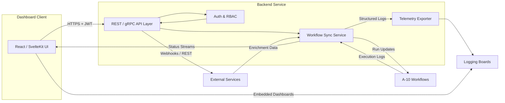

# Dashboard Platform Architecture

This document outlines the proposed architecture for the cyber operations dashboard, covering backend and frontend technology choices, security posture, external integrations, and the directory structure for implementation.

## Backend Service

- **Primary Framework:** FastAPI (Python 3.11)
  - Async-first request handling for high-frequency workflow polling and streaming updates.
  - Built-in OpenAPI schema generation to keep the dashboard client in sync with backend contracts.
  - Background tasks orchestrate A-10 workflow execution monitoring and push notifications.
- **Alternate Option:** Flask with Flask-RESTX for teams requiring a simpler sync model or existing Flask expertise.
  - Use Celery + Redis for asynchronous workflow tracking if Flask is selected.
- **Core Components:**
  - `routers/` modules exposing workflow summaries, detailed run metadata, and real-time status endpoints.
  - `services/` for encapsulating integration logic with A-10 automation, logging boards, and external services.
  - `schemas/` powered by Pydantic for input/output validation and response typing.
  - `auth/` utilities implementing OAuth2/OpenID Connect flows and RBAC enforcement.

## Frontend Application

- **Primary Framework:** React 18 with Vite for rapid HMR and TypeScript-first development.
  - Leverage React Query for data synchronization with the FastAPI backend.
  - Component-driven layout matching the supplementary [component tree](./component-tree.md).
- **Alternate Option:** SvelteKit for teams preferring Svelte's reactivity and server-side rendering capabilities.
  - Simplified data fetching through `load` functions, aligning with the structure documented in the component tree file.
- **Shared Frontend Concerns:**
  - Internationalization scaffolding using `i18next` or SvelteKit's `@sveltekit-i18n`.
  - Reusable visualization layer via `visx` or `Svelte Charts` for workflow metrics.

## Authentication and Authorization

- **Identity Provider:** Integrate with corporate IdP supporting OAuth2/OIDC (e.g., Azure AD, Okta).
- **Session Strategy:**
  - Backend issues short-lived JWT access tokens with refresh tokens stored in httpOnly cookies.
  - Optional WebAuthn or FIDO2 device binding for elevated privilege workflows.
- **Access Control:**
  - Role definitions: `analyst`, `operator`, `auditor`, `admin`.
  - Attribute-based rules ensure A-10 workflow execution rights align with mission scope.
  - Audit trails persisted to the logging boards for every critical action.

## Integration APIs

- **A-10 Workflow Orchestrator:** gRPC or REST clients to ingest workflow definitions, dispatch runs, and stream status updates via server-sent events (SSE) or WebSockets.
- **Logging Boards:**
  - Bi-directional integration with ELK/Grafana/Chronograf stacks for ingesting telemetry and surfacing contextual dashboards within the UI.
  - Structured log push using OpenTelemetry exporters from both backend and frontend.
- **External Services:**
  - Threat intelligence enrichment APIs (STIX/TAXII) to augment workflow results.
  - Ticketing systems (ServiceNow/Jira) for automated case creation from workflow outcomes.

## Proposed Directory Structure

```
dashboard/
├── backend/
│   ├── app/
│   │   ├── auth/
│   │   ├── routers/
│   │   ├── schemas/
│   │   ├── services/
│   │   └── workers/
│   ├── tests/
│   └── pyproject.toml
├── frontend/
│   ├── react-app/
│   │   ├── src/
│   │   └── package.json
│   └── sveltekit-app/
│       ├── src/
│       └── package.json
├── component-tree.md
└── README.md
```

## Data Flow Overview



## Supplementary Assets

- [Component Tree](./component-tree.md): Detailed React and SvelteKit component hierarchies aligned with the architecture above.

